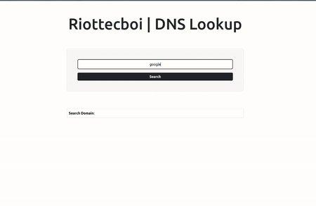

# DNS Lookup Web Application

A DNS (Domain Name System) lookup web application built using FastAPI to retrieve and display DNS records and WHOIS information for a specified domain name.

## Overview

DNS records are crucial for translating human-friendly domain names, like `github.com`, into IP addresses that computers use to identify each other on the network. This translation is fundamental for accessing websites, sending emails, and other internet functionalities. WHOIS information provides details about the domain registration, including the registrant's contact information, domain status, and key dates.

## Features

- Fetch and display WHOIS information, including registrant details, domain status, and registration dates.
- User-friendly web interface powered by FastAPI.
- Geolocation mapping using Folium and Geopy.



## Project Structure

````bash
DNS-Lookup/
├── app/
│   ├── core/
│   │   └── _config.py
│   │   └── settings.cfg
│   ├── routes/
│   │   └── _dnsLookup.py
│   ├── schemas/
│   │   ├── _dnsRequest.py
│   │   └── _whoisInfo.py
│   └── utils/
│       └── _dns.py
├── main.py
├── requirements.txt
├── static/
│   └── ... (static files)
└── templates/
    └── index.html
`````````````

## Installation

Clone the repository:

```bash
git clone https://github.com/riottecboi/DNS-Lookup.git

```````````
```bash
cd DNS-Lookup
pip install -r requirements.txt
`````````````

## Usage

1. Start the FastAPI server:

```bash
uvicorn main:app --reload
`````````

2. Open your web browser and navigate to `http://localhost:8000`

3. Enter a domain name in the provided input field.

4. View the DNS records and WHOIS information displayed on the web page.

## Acknowledgments

- FastAPI for the web framework.
- Geopy for geocoding and location services.
- Folium for interactive maps.
- python-whois for WHOIS lookups.